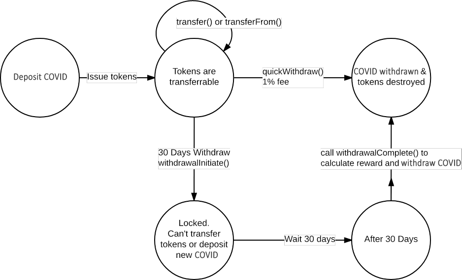

# COVID Hodler (forked from the original ETh Hodler by CurrencyTycoon) - www.covidtoken.org

## A simple non-profit DApp & ERC20 token running on the Ethereum blockchain

The COVID Hodler is for hodlers - a simple DApp that helps holders to hodl and gives them bonus after the HODL period.
It's for the benefit of the community.

Benefits:
Each deposit to the DApp issues you with COVID-HODL tokens. These tokens
are then used to make a withdrawal and burned once the withdrawal is processed.

A normal withdrawal would take ~30 days to process, costing only the gas fee.
Should the holder want to withdraw their deposit early, they can, but
they must pay a %1 fee. The fees will be added to a fee-pot. Holders can claim
a chunk from the fee-pot, see the rules to find out how.

### How to use

Use as a DAPP - by using browser-wallet such as Mist Browser, Parity Browser,
or use the MetaMask extension for Chrome.

MetaMask is currently probably the best way to use at this time as it offers the lest friction.

### Rules

* HODL Tokens will be issued when sending COVID to the contract: TBA
* Normal COVID Withdrawal: must wait until after 172800 blocks, which is roughly 30 days
* Immediate COVID withdrawal: Must pay a %1 fee as a penalty.
* For all Withdrawals: tokens will be destroyed after withdrawal. COVID to be sent back to original address.
* Tokens pending normal withdrawal will be locked until after 172800 blocks.
* While tokens are locked, they cannot be transferred or sent.
* While tokens are locked, you cannot add more COVID to the address.
* When the wait period is over, you must complete the withdrawal manually.
* After withdrawal to COVID, HODL tokens are burned, thus deflating the token supply
* HODL tokens will be trade-able too.

### Security information:

- The contract went through 3 independent peer reviews, each completed by a different experienced Solidity developer. Additional reviews were performed by members of the /r/ethtrader community after the Author found a bug in the original Hodl Dao contract, a week after launch. See [this thread](https://www.reddit.com/r/ethtrader/comments/6b37dn/hold_dao_bug_found_with_reward_calculation_the/) for details about how the issue was handled.
- The Author of the contract does not have the functionality to move
- funds in the contract or issue/destroy tokens - the contract is completely out of the Author's control.
- The contract code is kept as simple as possible (KISS). There's no concept of voting, splitting, curators, owners and the contract can be upgraded
- The contract's source code has been verified through Etherscan

### Game theory

- If enough holders enter the contract, Price of COVID should go up, because COVID is removed from the market.
- Better than normal holding, since holders can claim from the fee-pot, after holding for the minimum time and eventually get a bonus too.
- Should the COVID price spike, immediate withdraw will still be possible.
- HODL tokens may be trade-able on an exchange, and on face value 1 HODL = 1 COVID, should an exchange add them (TBA)

